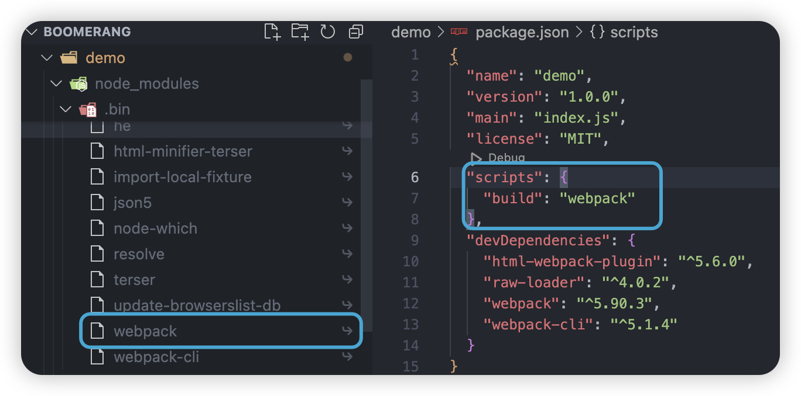

前端项目，在 npm install 后会生成 node_modules 文件夹，这是项目安装的依赖。打开之后，第一个文件夹就是 .bin 文件夹。

(windows系统下)该文件夹下，同名的可执行文件，无后缀名对应 unix 系统的 shell 脚本， .cmd 后缀的对应 windows 的 bat 脚本，本质都是执行的同一个文件。

当依赖包的配置文件 package.json 中有 bin 字段, 在安装此依赖时, 会自动在项目中的 node_modules/.bin 目录中生成指向依赖包 bin 字段的软链接(symlink)执行文件。



当执行 npm run 时，会自动创建一个 Shell，并在内部执行指定的脚本命令。在创建 Shell 的同时，会讲 node_modules/.bin 的可执行命令都添加到系统 PATH 中，执行结束后，再移除。所以可以在 scripts 中直接用。

一个依赖包，可能有一个或者多个可执行文件，当只有一个可执行文件时，脚本命令应当与依赖包同名。同时该执行文件顶部必须以 `#!/user/bin/env node` 开头。

```json
{ "name": "my-app", "version": "1.0.1", "bin": "./program/cli.js" }
```

```json
{
  "name": "my-app",
  "version": "1.0.1",
  "bin": { "my-app": "./program/cli.js" }
}
```


1. [package.json](https://docs.npmjs.com/cli/v6/configuring-npm/package-json#bin)
2. [npm scripts 使用指南  阮一峰](https://www.ruanyifeng.com/blog/2016/10/npm_scripts.html)